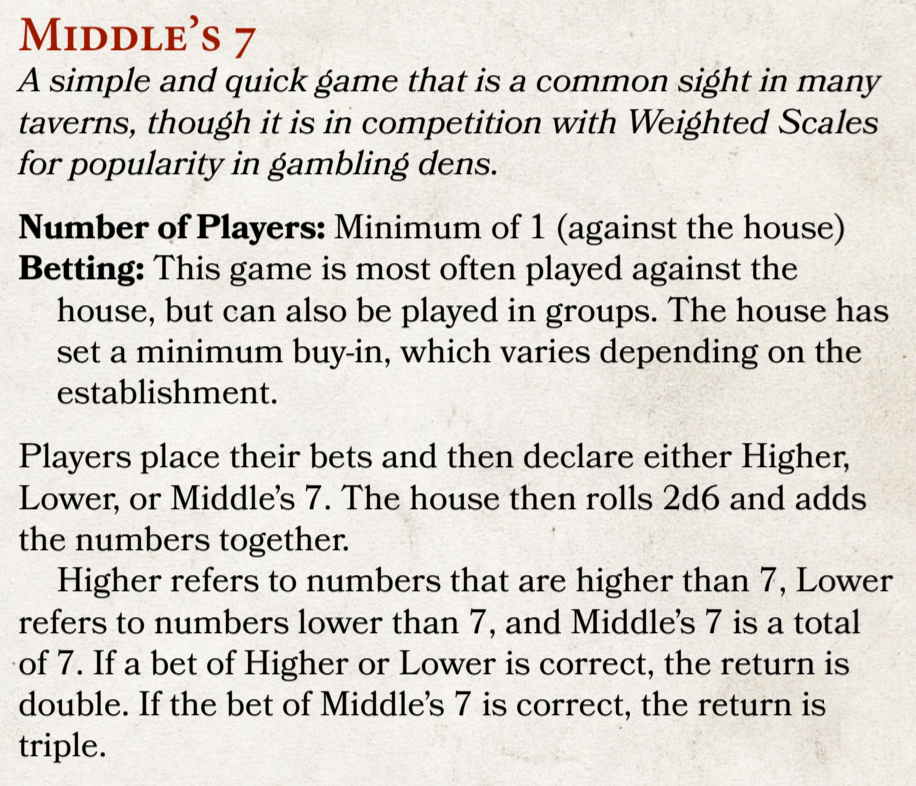
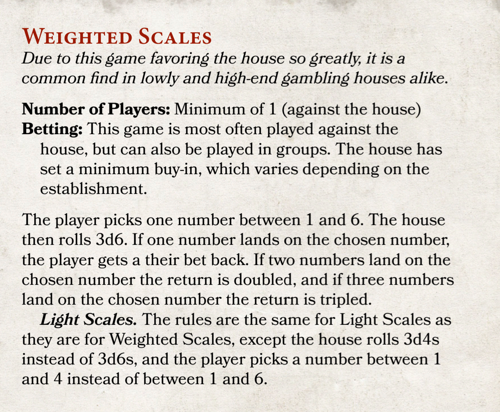

## Episode 1, Session 2
### Dead Men Tell No Tales
---

**Housekeeping**  
- Max
  - Damage Thresholds
  - Evasion
  - Armour
---
**Recap from Session 1**
The Restless set sail from the soot-choked commercial port of Faulmoth, in the lands governed by the Council of the Circle, but the shadows of the city followed you aboard. Faji, you’ve stepped into the role of mentor and watchman, finding your rhythm with the creak of the hull and the groans of cables. Kiwi, you’ve manifested as a bartender out of thin air—slow by day, the life of the party by night—all while keeping Huckleberry 'not for sale.' And Linna, a mysterious trunk and a secret letter have left you as the sole guardian of Fel’las, a very elder, elven stowaway currently in your wardrobe.

But the quiet of the maiden voyage was shattered. An impact against the port side of the ship has shaken its passengers and crew awake. Outside, a graveyard of wreckage litters the waves—shattered lifeboats, floating vests, and the haunting silhouette of a dying ship on the horizon. As far as you know, only Linna and Kiwi are below decks -- well, and Fel-las, though Kiwi did pop up above decks long enough to try to deliver some alcohol -- Captain's orders -- and then get shut down by Faji.

----
[Start music/sound effects]

**Spotlight Grotto**
- Unconscious on a floating crate
- What does he remember from before he passed out?

**Spotlight Faji**
- The Restless draws nearer to the centre of the debris field
- When Faji is able to recognize the wreckage of his old ship, the Bangle, a voice echoes in a way that makes him feel like the entire world must hear it -- or that he is alone in the world and it is carrying through everything. It pushes all other thoughts and distractions from his mind.
> Faji Dobady, we have seen you. I see the devotion in you. We are not always quick to correct injustices, but there must be balance in the world. We are weakened, but we are not yet extinct, and so we do what we can. It has been millennia since we have been able to do it alone. There are those on your journey who are vulnerable, as you were once vulnerable, and they will need your protection. We ask, I ask, that you provide this protection and avenge those who are preyed upon, and in return my people will grant you all that we can to see you through successfully. We can grant you flight, or provide you with a weapon of legend, forged by our greatest smiths, and in return ask only that you act as an avatar of our divine will and aid us in the fight to balance the scales of justice in the Mortal Realm.
- From this point onward, Faji will be a Seraph
  - Which subclass?

**On the open deck**
- Someone needs to roll an Instinct check (DC 15)
- On a 15 or higher, Grotto's body is spotted, floating on a crate
- On an 18 or higher, both Grotto and a Faceless Friend are spotted
- If Grotto's body is **not found** (Instinct check fails), proceed to spotlighting Linna, then jump to Grotto waking up and swimming toward the Restless

**Spotlight Linna, after Grotto brought aboard**
- Below decks, Linna has just been begged by Fel'las to come back and retrieve him if the boat is sinking -- something she gave a very disingenuine-sounding agreement to.
- As both Linna and Fel'las wait for news of what's happening above decks, Fel'las begins to sing a haunting, traditional seafaring song about a battle between waves and rock

**Circle Inspection**
- A smaller, faster and more nimble ship appears on the horizon behind The Restless and quickly catches up. It flies the flag of The Council of the Circle and two officers (initially) of The Circle board.
- Demand to interview each passenger and crew member on board to try to ascertain their identity; they're searching for people for whom there are Government Warrants issued
  - List is too long to share
- If social interaction goes well (any member of the party able to pass a DC 15 presence check, if acting as a united front, or each individual able to pass a DC 15 presence check if acting as individuals), the officers leave once they've decided nobody is on their list
- If DC15 Presence check fails (by 1 or more party members), the Circle officers shake down the passengers and crew for any valuables or items that are important to them.

**Gambling**

**Don't forget downtime!**
